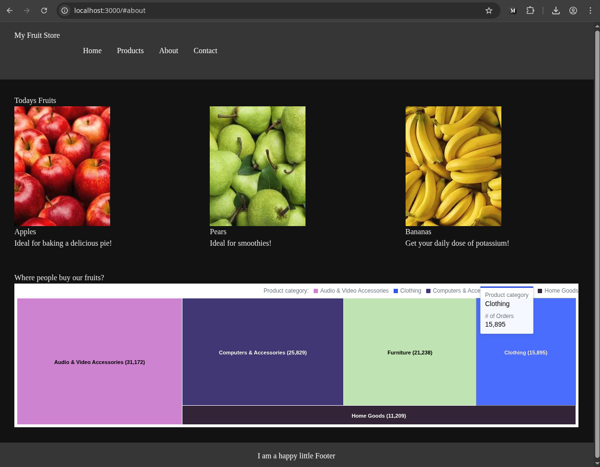

# Next.js 15 + React 19 with GoodData

This is a [Next.js](https://nextjs.org) v16 project bootstrapped with [`create-next-app`](https://nextjs.org/docs/app/api-reference/cli/create-next-app), integrated with GoodData for data visualization.

## Tech Stack

- **Next.js 16** (App Router)
- **React 19**
- **TypeScript**
- **Tailwind CSS v4**
- **GoodData SDK** (`@gooddata/sdk-backend-tiger`, `@gooddata/sdk-ui-*`)



## Getting Started

### Step 1: Install Dependencies

```bash
npm install
```

### Step 2: Set Environment Variables

1. Copy the environment template:
   ```bash
   cp .env.local.template .env.local
   ```

2. Edit `.env` with your GoodData configuration:
   ```
   NEXT_PUBLIC_GD_HOSTNAME="https://your-org.cloud.gooddata.com"
   NEXT_PUBLIC_GD_WORKSPACE_ID="your-workspace-id"
   NEXT_PUBLIC_GD_INSIGHT_ID="your-insight-id"
   ```

3. Edit `.env.local` with your API token:
   ```
   NEXT_PUBLIC_GD_API_TOKEN="your-api-token"
   ```

#### Finding Your Configuration Values

- **HOSTNAME & WORKSPACE_ID**: Open a GoodData dashboard and find them in the URL:
  ```
  https://<HOSTNAME>/dashboards/#/workspace/<WORKSPACE_ID>/dashboard/<DASHBOARD_ID>
  ```

- **INSIGHT_ID**: Navigate to the Analyze tab and open a visualization:
  ```
  https://<HOSTNAME>/dashboards/#/workspace/<WORKSPACE_ID>/<INSIGHT_ID>/edit
  ```

- **API_TOKEN**: See [Create an API token](https://www.gooddata.com/developers/cloud-native/doc/cloud/getting-started/create-api-token/) documentation.

> ⚠️ **Security Note**: For production deployments, use OAuth instead of API tokens to avoid leaking credentials.

### Step 3: Configure CORS

1. Navigate to your GoodData instance
2. Go to Settings
3. Add your development origin (e.g., `http://localhost:3000`) to allowed CORS origins

For detailed CORS configuration, see the [official documentation](https://www.gooddata.com/docs/cloud/manage-organization/set-up-cors-for-organization/).

### Step 4: Run the Development Server

```bash
npm run dev
```

Open [http://localhost:3000](http://localhost:3000) with your browser to see the result.

## Project Structure

```
src/
├── app/
│   ├── components/
│   │   └── GoodDataChart.tsx    # GoodData visualization component
│   ├── globals.css              # Global styles + GoodData CSS imports
│   ├── layout.tsx               # Root layout with GoodData styles
│   └── page.tsx                 # Main page with fruit store demo
```

## GoodData Integration

The integration follows these key steps:

1. **Backend Setup**: Create a Tiger backend with authentication:
   ```typescript
   const backend = tigerFactory()
     .onHostname(process.env.NEXT_PUBLIC_GD_HOSTNAME!)
     .withAuthentication(
       new TigerTokenAuthProvider(process.env.NEXT_PUBLIC_GD_API_TOKEN!)
     );
   ```

2. **Provider Wrapping**: Wrap components with `BackendProvider` and `WorkspaceProvider`:
   ```typescript
   <BackendProvider backend={backend}>
     <WorkspaceProvider workspace={process.env.NEXT_PUBLIC_GD_WORKSPACE_ID!}>
       <InsightView insight={process.env.NEXT_PUBLIC_GD_INSIGHT_ID!} />
     </WorkspaceProvider>
   </BackendProvider>
   ```

3. **Client-Side Rendering**: Use `"use client"` directive for GoodData components.

## Available Scripts

- `npm run dev` - Start development server
- `npm run build` - Build for production
- `npm run start` - Start production server
- `npm run lint` - Run ESLint

## Catalog Export (Optional)

Generate TypeScript representations of your GoodData workspace objects:

```bash
npx @gooddata/catalog-export --hostname <your-hostname> --workspace-id <your-workspace-id> --output src/catalog.ts
```

## Learn More

- [GoodData.UI Documentation](https://www.gooddata.com/docs/gooddata-ui/latest/)
- [GoodData.UI Architecture Overview](https://www.gooddata.com/docs/gooddata-ui/latest/architecture/architecture_overview/)
- [Next.js Documentation](https://nextjs.org/docs)
- [React 19 Documentation](https://react.dev)

## Free Trial

If you need a GoodData backend to test against, use the [free trial](https://www.gooddata.com/trial/).
